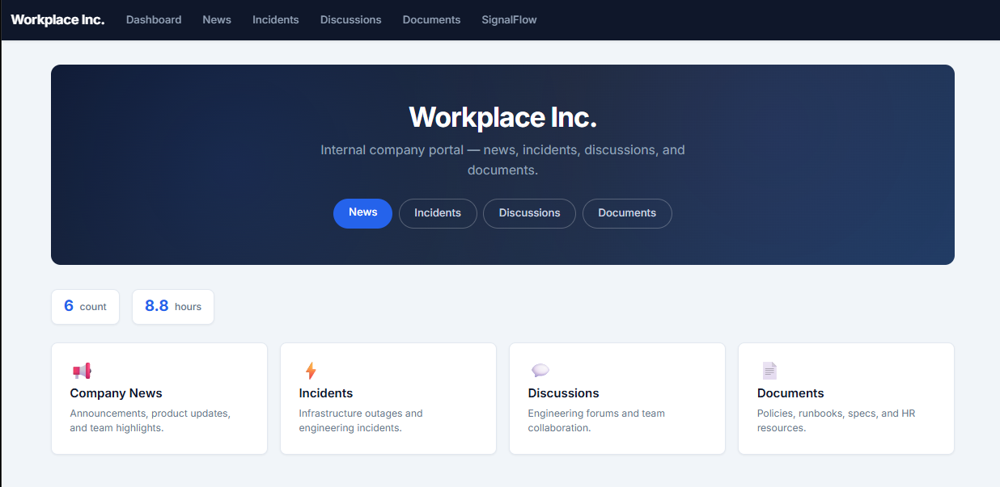

# WorkplaceIQ

A metadata-driven content platform for building intranets, knowledge hubs, and operational portals using abstract primitives — containers, content items, labels, and relationships.



## Quick Start

```powershell
# Local (SQLite)
dotnet run --project src\WorkplaceIQ.Web\WorkplaceIQ.Web.csproj

# Docker (with MinIO file storage)
docker compose up --build
```

App: `http://localhost:4792`. MinIO: `http://localhost:9000` / console at `:9001` (`workplaceiq` / `workplaceiq-secret`).

## Projects

| Project | Purpose |
|---------|---------|
| `WorkplaceIQ` | Core domain model, service interfaces, metric providers |
| `WorkplaceIQ.AspNet` | EF Core DbContext, Tag Helpers, HTML renderers, S3/MinIO storage |
| `WorkplaceIQ.Web` | Demo/reference app (SQLite, seeded data) |
| `WorkplaceIQ.ServiceDefaults` | OpenTelemetry, health checks, resilience |
| `WorkplaceIQ.AppHost` | .NET Aspire orchestrator (PostgreSQL + MinIO) |
| `WorkplaceIQ.Tests` | NUnit tests |

## Tag Helpers

| Tag | Renders |
|-----|---------|
| `<iq-feed>` | Activity stream with posts, labels, comments |
| `<iq-forum>` | Threaded discussions |
| `<iq-files>` | File library with upload/download (S3/MinIO) |
| `<iq-entity>` | Single business entity detail view |
| `<iq-entity-list>` | Entity directory with relationships |
| `<iq-metric>` | Configurable metric card (count / sum / avg / min / max) |

Prefix: `iq-`. Registered via `@addTagHelper *, WorkplaceIQ.AspNet`.

## Architecture

See [ARCHITECTURE.md](ARCHITECTURE.md) for the core domain model (ADR-02), data access layer, component services, tag helper internals, metrics platform, file storage, storage providers, web app details, infrastructure, and test coverage. Architecture Decision Records (ADRs) are in [`docs/adr/`](docs/adr/).

## What's Next

- **[ADR-03](docs/adr/03-ADR-UI-DualLayer.md): Dedicated Controllers** — Refactor the web layer into per-container-type controllers (Feed, Forum, File, Entity).
- **[ADR-04](docs/adr/04-Metrics-Platform.md): Stored Metrics** — Dual-category metrics (computed + persisted) exposed via OTel `/metrics` and CMS URLs.
- **AI & Intelligence** — Vector/semantic search, AI chat (RAG), summaries/digests, insights engine with trend detection and anomaly identification.
- **UI Components** — Dashboards, system-generated virtual views, additional tag helpers (`<iq-ai-chat>`, `<iq-dashboard>`).
- **Platform Features** — Permissions & security, multi-tenant support, full-text search, metadata schemas, knowledge base container type.
- **Infrastructure** — Admin UI, pluggable renderers, audit logging, deployment templates (Helm/Bicep), component marketplace.

## Tech Stack

.NET 10 / ASP.NET Core MVC / EF Core 10 / SQLite (default) + PostgreSQL (optional) / S3 + MinIO / Bootstrap 5 / OpenTelemetry / NUnit 4 / Semantic Kernel VectorStore connectors.

## Build & Test

```powershell
dotnet restore
dotnet build --configuration Release
dotnet test --configuration Release
```
